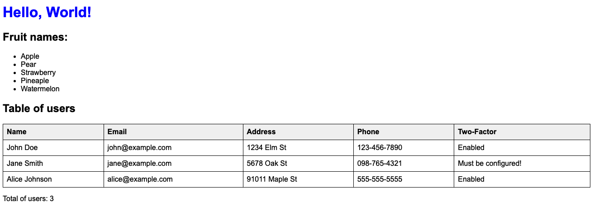

# FreeMarker with Java Example

## Project Structure
- **src**: Contains the Java source code.
- **templates**: Contains the FreeMarker template (`example.ftl`).
- **lib**: Contains the FreeMarker library JAR file.

## Setup and Running the Project

### Prerequisites

- **Java Development Kit (JDK)**: Ensure you have JDK 8 or a compatible version installed.
- **FreeMarker**: Include the FreeMarker library JAR in the `lib` directory.

### Steps

1. **Clone the repository** (if applicable) or copy the files to your local machine.

2. **Navigate to the project directory**:

  ```sh
   cd freemarker-simple-example
  ```
3. **Run build.sh bash**:

```sh
  bash ./build.sh
```

### Output
You will receive this html file

